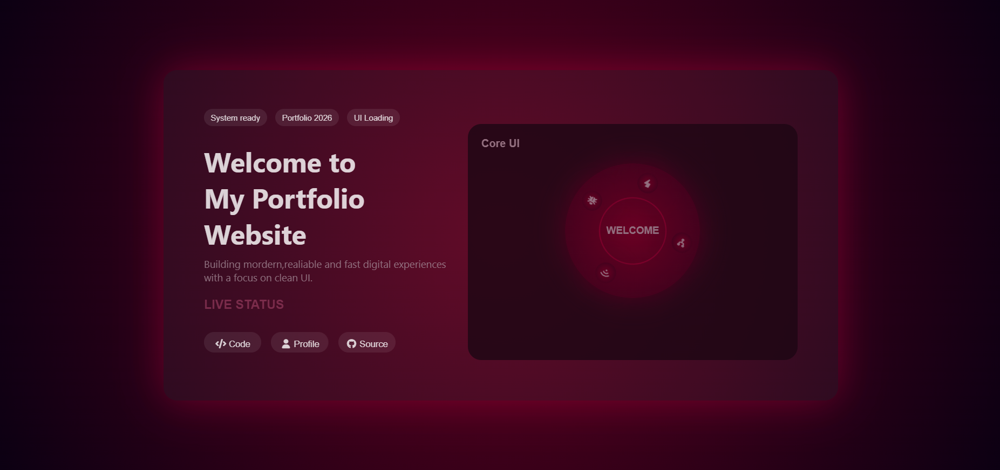

# Personal Portfolio Website 🌐

A personal portfolio website designed and developed using HTML, CSS, and JavaScript —
showcasing my projects, skills, and contact information in a clean, modern interface.

## Preview

## About the project

This portfolio was built entirely from scratch without any frameworks or libraries.
The goal was to create a professional, dark-themed personal space on the web that reflects
my skills as a frontend developer — with smooth animations, responsive layout, and an
interactive UI that leaves a lasting impression.

## Features

- Modern home section with smooth animations and transitions
- Dedicated projects section showcasing my work with links
- Clean and minimal contact page
- Fully responsive design across mobile, tablet, and desktop
- Interactive UI with subtle hover and scroll transitions
- Dark-themed aesthetic for a professional look

## Tech used

## What I focused on

- Building a multi-section single-page layout from scratch
- CSS animations and transitions for a polished, premium feel
- Responsive design using Flexbox and CSS Grid
- Dark theme implementation with consistent color palette
- Clean code structure across separate HTML, CSS, and JS files

## Sections

| Section | Description |
|---------|-------------|
| Home | Hero section with intro, name, and animated tagline |
| About | About section with more information |
| Projects | Cards showcasing all my projects with live links |
| Contact | Clean contact form and social media links |

## How to run

1. Clone the repo or download the files
2. Open the `.html` file in your browser
3. No installs needed — opens instantly

## Live demo
[View it here](https://vaishnavi280506.github.io/Portfolio/)

## Built by
Vaishnavi Vingale · [LinkedIn](https://www.linkedin.com/in/vaishnavi-vingale-08a517345) · [GitHub](https://github.com/Vaishnavi280506)
